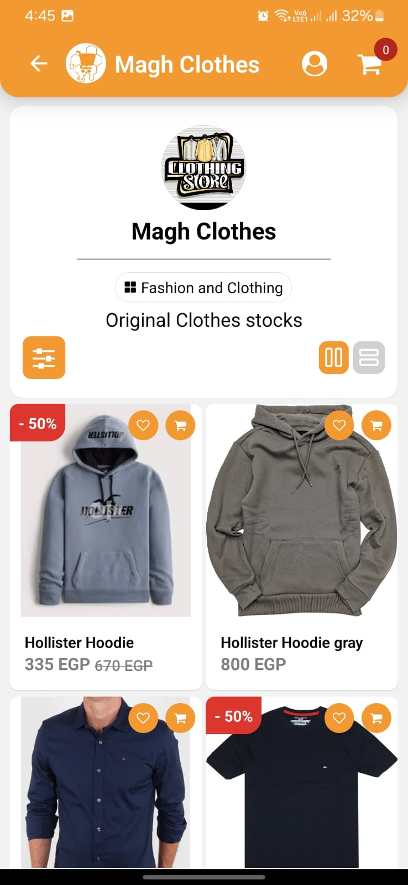

# Market Hive Mobile Client

This mobile version of the dynamic marketplace platform consolidates multiple online stores into one intuitive app. Users can browse, search, and purchase products from a variety of vendors with ease. The app integrates secure user authentication, a smooth checkout process with Stripe, and product management, ensuring a seamless shopping experience.
## Features

- **Vendor Management:** Multiple vendors can showcase their products.
- **Product Search & Filtering:** Users can easily find products across all vendors.
- **Cart & Checkout:** Seamless checkout process with multiple payment options.
- **User Authentication:** Secure login and registration with Firebase.
- **Responsive Design:** Fully optimized for desktop and mobile views.
- **Cross-Platform:** Built using React Native and Expo for Android and iOS compatibility.

## Tech Stack
  
**Client-side**

- React Native (Expo): For building cross-platform mobile applications.
- React Native Paper: For UI components and consistent design.
- React Navigation: For navigation between screens.

**Server-side**

- Firebase Authentication: For secure user authentication and session management.
- Firestore Database: To store and manage app data, such as product information.
- Firebase Cloud Storage: For uploading and storing images.
- Stripe: Integrated for handling secure payments within the app.
## Screenshots





## Installation

1 - Clone the repository:

```bash
  git clone https://github.com/yourusername/marketplace-mobile.git
```
2 - Navigate to the project directory:

```bash
cd marketplace-mobile
```

3 - Install the necessary dependencies:

```bash
npm install
```

4 - Start the Expo development server:

```bash
expo start
```
    
## Configuration

To connect the app with Firebase, update the firebaseConfig object in the firebase.js file with your Firebase project credentials:

```js
const firebaseConfig = {
  apiKey: "YOUR_API_KEY",
  authDomain: "YOUR_PROJECT_ID.firebaseapp.com",
  projectId: "YOUR_PROJECT_ID",
  storageBucket: "YOUR_PROJECT_ID.appspot.com",
  messagingSenderId: "YOUR_MESSAGING_SENDER_ID",
  appId: "YOUR_APP_ID",
};

```

Stripe is integrated for secure payments:
 ```js
 const stripe = require('stripe-client')(process.env.STRIPE_PUBLISHABLE_KEY);

 ```
## Running on physical device

1 - Install the Expo Go app on your Android or iOS device.

2 - Scan the QR code displayed in the terminal after running expo start.


## Contributing

Feel free to submit issues or pull requests to help improve this platform. Contributions are always welcome!


## License
This project is licensed under the MIT License.


[MIT](https://choosealicense.com/licenses/mit/)


## 🚀 About Me

I’m Mahmoud Elmaghraby, a software developer specializing in frontend development with expertise in ReactJS/NextJS and cross-platform mobile development using React Native and Flutter. 
